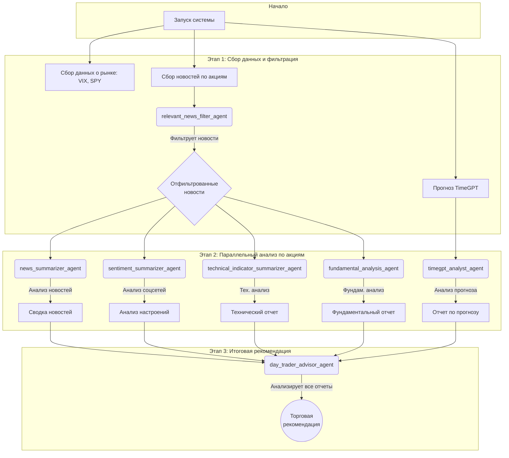

# AI Trading Crew

## Описание системы

**AI Trading Crew** — это автоматизированная система на базе искусственного интеллекта, 
предназначенная для комплексного анализа финансовых рынков. Она использует команду автономных AI-агентов 
(созданных с помощью фреймворка **CrewAI**) для сбора, обработки и анализа данных по заданным акциям 
(тикерным символам).

Основная цель системы — предоставить всесторонний отчет по каждой акции, включающий:
-   Анализ новостного фона.
-   Оценку настроений в социальных сетях.
-   Технический анализ на основе индикаторов.
-   Фундаментальный анализ компании.
-   Прогнозирование временных рядов с помощью TimeGPT.
-   Итоговую торговую рекомендацию.

Система является расширяемой и настраиваемой через конфигурационные YAML-файлы.

## Порядок работы агентов

Процесс анализа разбит на несколько последовательных этапов (Crews), где на каждом этапе работают 
специализированные агенты.

### Этап 1: Обзор рынка и фильтрация новостей

1.  **Сбор общих данных**: Система начинает со сбора данных по глобальным рынкам (индекс VIX, мировые 
индексы), чтобы понять общий контекст.
2.  **Прогноз TimeGPT**: Запускается модель TimeGPT для построения прогнозов по временным рядам для всех 
целевых акций.
3.  **Фильтрация новостей (`AiArticlesPickerCrew`)**:
    *   **`relevant_news_filter_agent`**: Этот агент просматривает большой объем новостей по каждой акции
	и отбирает только самые значимые и релевантные статьи, которые могут повлиять на цену актива. Результат
	сохраняется для следующего этапа.

### Этап 2: Комплексный анализ и обобщение (`StockComponentsSummarizeCrew`)

На этом этапе для каждой акции параллельно запускается команда агентов, которые работают с данными, 
подготовленными на предыдущем шаге.

1.  **`news_summarizer_agent`**: Анализирует отфильтрованные новости и формирует краткую сводку, выделяя 
	ключевые позитивные и негативные моменты.
2.  **`sentiment_summarizer_agent`**: Изучает данные из социальных сетей (например, StockTwits) и 
	составляет отчет о преобладающих настроениях инвесторов (бычьи или медвежьи).
3.  **`technical_indicator_summarizer_agent`**: Рассчитывает и интерпретирует различные технические 
	индикаторы (RSI, MACD, Bollinger Bands и др.), предоставляя заключение о текущем техническом состоянии
	акции.
4.  **`fundamental_analysis_agent`**: Проводит фундаментальный анализ компании, изучая ее финансовые 
	показатели и отчетность.
5.  **`timegpt_analyst_agent`**: Анализирует и интерпретирует прогнозы, полученные от TimeGPT.

### Этап 3: Формирование торговой рекомендации (`DayTraderAdvisorCrew`)

1.  **`day_trader_advisor_agent`**: Это финальный агент. Он получает и анализирует все отчеты, 
	подготовленные на втором этапе (сводку новостей, анализ настроений, технический, фундаментальный и 
	прогнозный анализы). На основе комплексной оценки всех факторов он формирует итоговую торговую 
	рекомендацию: **покупать (BUY)**, **продавать (SELL)** или **держать (HOLD)**.

## Результаты

Результаты работы системы сохраняются в директории `output/agents_outputs/`. Для каждой акции и для каждой 
даты запуска создается отдельная папка, в которой находятся следующие отчеты в формате Markdown (`.md`):

-   `news_summary_report.md`: Сводка новостей.
-   `sentiment_summary_report.md`: Анализ настроений.
-   `technical_indicator_summary_report.md`: Технический анализ.
-   `fundamental_analysis_summary_report.md`: Фундаментальный анализ.
-   `timegpt_forecast_summary_report.md`: Анализ прогноза TimeGPT.
-   `day_trading_recommendation.md`: Итоговая торговая рекомендация.

Логи работы агентов сохраняются в папке `logs/`.

## Функциональная схема системы

Ниже представлена диаграмма, иллюстрирующая рабочий процесс системы.

